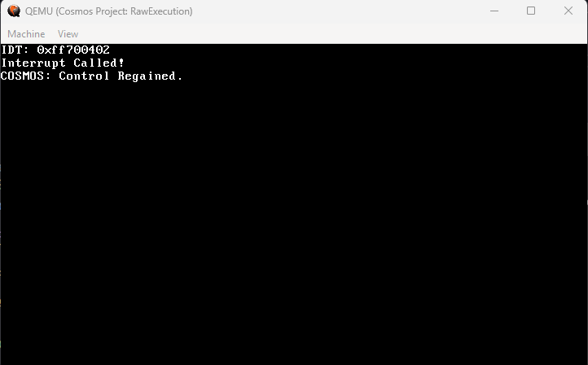

# Star Elf (Stellar's Awesome Reader [for] ELF)

## Overview

This project allows you to load and execute ELF files within a Cosmos-based C# operating system. It provides a small library with utility functions to interact with the operating system through direct function calls, including handling console input/output and memory management. (More functions will be added in the future.)

### Example Usage in C

```c
#include "Cosmos.h"

void example_IDT_GATE(void) {
    printf("Interrupt Called!\n");
}

NO_NAME_MANGLE void main(void*** funcTable) {
    debug_serial_init();
    Cosmos_RegisterFunctionTable(funcTable);

    clrscr();

    get_current_idt();
    idt_ptr_t idt = get_idt();
    set_idt_gate(0x80, (int)example_IDT_GATE, 0x08, 0x8E);
    set_idt(idt);

    printf("IDT: 0x%p\n", &idt);

    asm volatile("int $0x80");

    return;
}
```



### Key Features

- **IDT Management**: Functions to set and retrieve the IDT (Interrupt Descriptor Table).
- **Console Operations**: Includes functions for writing and reading text (UTF-16/ASCII) and clearing the console screen.
- **Memory Management**: Functions to allocate, free, and manipulate memory (malloc, calloc, realloc).
- **Basic I/O Functions**: Support for printing integers, floats, and other data types to the console.
- **ELF File Loading**: Enables loading ELF files into memory and executing them in a Cosmos OS environment.

### Functions Provided

- **IDT Functions**:
  - `set_idt_gate()`, `get_idt()`, `set_idt()`
- **Console Functions**:
  - `Console_WriteLine16()`, `Console_Write16()`, `Console_ReadLine16()`
  - `Console_WriteLineA()`, `Console_WriteA()`, `Console_ReadLineA()`, etc...
- **Memory Management**:
  - `Heap_Alloc()`, `Heap_Free()`
- **ELF Loader**: Load and execute ELF files within the Cosmos OS environment.
  
### Getting Started

1. Download the project files.
2. Open the `CosmosExec` DIR to find the C files.
<br/> 2.1 You can compile these with `make`. Run `make build` to compile the project. (Auto copied)
3. Open the `RawExecution` DIR to find the C# files and kernel.
4. Play/Build as normal in Visual Studio.
5. That's it! You can now run the kernel and load ELF files.

### C# Integration

```c#
using Cosmos.Core;
using Cosmos.Core.Memory;
using Cosmos.HAL;
using Stellib.Drivers.Injection;
using System;
using System.Collections.Generic;
using System.Text;
using Sys = Cosmos.System;
using Stellib.ELF;
using IL2CPU.API.Attribs;
using XSharp.Assembler;
using Cosmos.Core_Asm;
namespace RawExecution
{
    public unsafe class Kernel : Sys.Kernel
    {
        [ManifestResourceStream(ResourceName = "RawExecution.Drivers.ELF.TestElf")]
        public static byte[] TestElf;
        protected override void BeforeRun()
        {
            byte[] nElf = new byte[TestElf.Length];
            for (int i = 0; i < TestElf.Length; i++)
            {
                nElf[i] = TestElf[i];
            }
            Elf32 elf = new Elf32(nElf);
            elf.PrintElfInfo();
            elf.LoadElf();
            Console.WriteLine("COSMOS: Control Regained."); 
        }

        protected override void Run()
        {
        }
    }
}
```

### Current Rewrite of STDLIB

```c++
1. malloc()
2. free()
3. calloc()
4. realloc()
5. itoa()
6. ltoa()
7. utoa()
8. ultoa()
9. uitoa()
10. printf()
11. sprintf()
12. snprintf()
13. vsnprintf()
14. vsprintf()
15. clrscr()
```